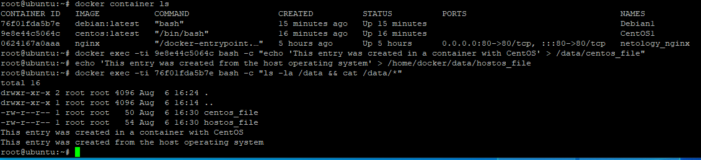
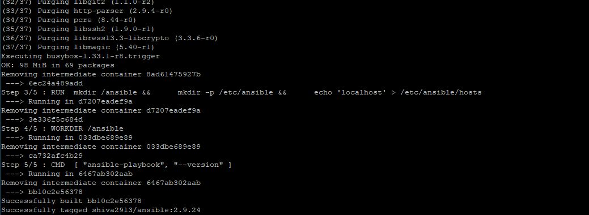

# Домашнее задание к занятию "5.3. Введение. Экосистема. Архитектура. Жизненный цикл Docker контейнера"


```console
# apt-get remove docker docker-engine docker.io containerd runc
# apt-get update
# apt-get install     apt-transport-https     ca-certificates     curl     gnupg     lsb-release
# curl -fsSL https://download.docker.com/linux/ubuntu/gpg | sudo gpg --dearmor -o /usr/share/keyrings/docker-archive-keyring.gpg
# echo   "deb [arch=$(dpkg --print-architecture) signed-by=/usr/share/keyrings/docker-archive-keyring.gpg] https://download.docker.com/linux/ubuntu $(lsb_release -cs) stable" | sudo tee /etc/apt/sources.list.d/docker.list > /dev/null
# apt-get update
# apt-get -y install docker-ce docker-ce-cli containerd.io
```

* Реализуйте функциональность: запуск веб-сервера в фоне с индекс-страницей, содержащей HTML-код ниже:

```console
# docker pull nginx
# docker run -dit --name netology_nginx -p 80:80 nginx
# docker exec -it netology_nginx /bin/bash
```

Затем отредактировал файл  /usr/share/nginx/html/index.html
После сделал commit и push  в свой репозиторий:

```console
# docker commit -m "Nginx image for Netology" -a "Vladimir Sakhnov" 0624167a0aaa  nginx:latestnew 
# docker tag 0a94c845e9b8 shiva2913/httpd:latestnew
# docker login
# docker push shiva2913/httpd:latestnew
```
### Ссылка на DockerHub
https://hub.docker.com/r/shiva2913/nginx


## Задача 2
Посмотрите на сценарий ниже и ответьте на вопрос: "Подходит ли в этом сценарии использование докера? Или лучше подойдет виртуальная машина, физическая машина? Или возможны разные варианты?"

Детально опишите и обоснуйте свой выбор.

--

Сценарий:

Высоконагруженное монолитное java веб-приложение;
Nodejs веб-приложение;
Мобильное приложение c версиями для Android и iOS;
Шина данных на базе Apache Kafka;
Elasticsearch кластер для реализации логирования продуктивного веб-приложения - три ноды elasticsearch, два logstash и две ноды kibana;
Мониторинг-стек на базе Prometheus и Grafana;
MongoDB, как основное хранилище данных для java-приложения;
Gitlab сервер для реализации CI/CD процессов и приватный (закрытый) Docker Registry.

* Высоконагруженное монолитное java веб-приложение;
  * В случае высоконагруженного монолитного приложения, думаю лучшим выбором будет baremetal или паравиртуализация.
* Nodejs веб-приложение;
  * Docker должен быть не плохим выбором в данном сценарии, если только нет особых требований к производительности.
* Мобильное приложение c версиями для Android и iOS;
  * Docker не подходит для данного сценария. Судя по информации в интернете, в Docker можно запустить приложение с графическим интерфейсом, но я бы лучше использовать виртуальные машины.
* Шина данных на базе Apache Kafka;
  * C Apache Kafka не знаком. По найденной информации в интернете, в этом сценарии успешно используют Docker.\
* Elasticsearch кластер для реализации логирования продуктивного веб-приложения - три ноды elasticsearch, два logstash и две ноды kibana;
  * Докер должен отлично подойти в данном сценарии.
* Мониторинг-стек на базе prometheus и grafana;
  * Docker также отлично подойдет
* Mongodb, как основное хранилище данных для java-приложения;
  * В данном сценарии думаю лучше использовать виртуальные машины.
* Gitlab сервер для реализации CI/CD процессов и приватный (закрытый) Docker Registry.
  * В данном сценарии я бы использовал виртуальные машины с паравиртуализацией. Также есть и официальный докер контейнер с Docker Registry, но я в этом смысла не вижу, если поднимается Docker Registry значит есть подребность хранить централизовано образы внутри своей инфраструктуры на постоянной основе, docker же не совсем подходит для этого. Я бы использовал виртульную машину и подключил iscsi или NFS с СХД.


## Задача 3

```Console
# docker pull centos
# docker pull debian
# docker run -dit --name CentOS1 -v /home/docker/data:/data centos:latest
# docker run -rit --name Debian1 -v /home/docker/data:/data debian:latest
```
Далее идет скриншот по выполнению заданий с созданием файлов:



## Задача 4



### Ссылка на DockerHub
https://hub.docker.com/r/shiva2913/ansible
