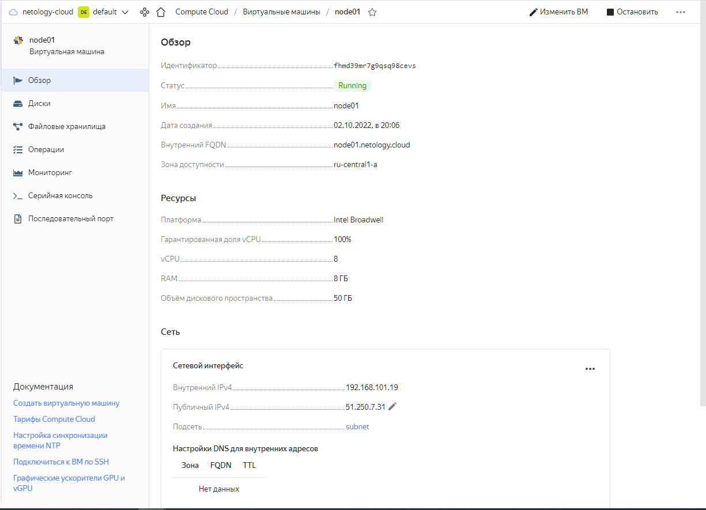

# Решение домашнего задания к лекции "4. Оркестрация группой Docker контейнеров на примере Docker Compose"

## 1. Создать собственный образ операционной системы с помощью Packer.

## 2. Создать вашу первую виртуальную машину в Яндекс.Облаке.

## 3. Создать ваш первый готовый к боевой эксплуатации компонент мониторинга, состоящий из стека микросервисов.

