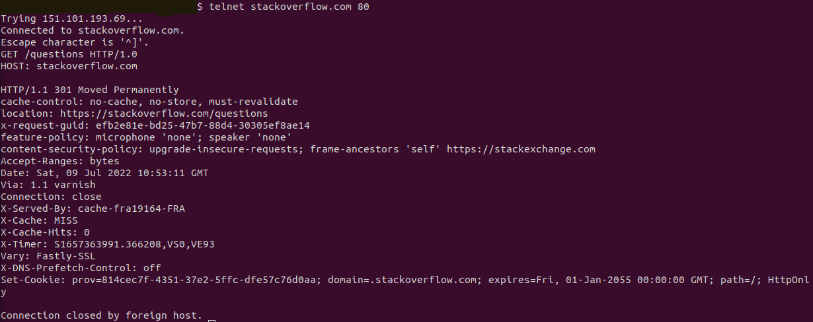

# Решение домашнего задания к занятию "3.6. Компьютерные сети, лекция 1"

### 1. Работа с HTTP через telnet:



В первой строчке ответа находится код ответа 301 (перемещен навсегда). Означает что данный ресурс был перемещен, и следует использовать URL который находится в разделе location (Что собственно браузер и сделает автоматически)

### 2. Повторите задание 1 в браузере, используя консоль разработчика F12.

* Ответ HTTP 307 Internal Redirect
* Сайт загрузился за 1.13c
* 

### 3. Какой IP адрес у вас в интернете?
* Можно узнать с помощью команды ниже
```
wget -O - -q icanhazip.com
```

### 4. Какому провайдеру принадлежит ваш IP адрес? Какой автономной системе AS? Воспользуйтесь утилитой whois
* Чтобы узнать провайдера и AS использовал команду приведенную ниже. В строке "descr:" будет название провайдера, в строке "origin:" будет AS 

```
MY_IP=$(wget -O - -q icanhazip.com) && whois -h whois.radb.net $MY_IP | grep -e 'descr:' -e 'origin:'
```

### 5. Через какие сети проходит пакет, отправленный с вашего компьютера на адрес 8.8.8.8? Через какие AS? Воспользуйтесь утилитой traceroute
* Скрин traceroute


* Сети через которые проходит маршрут: 92.125.40.0/21, 213.228.112.0/22, 72.14.197.0/24, 108.170.250.0/24, 172.253.66.0/24, 142.250.235.0/24, 142.250.235.0/24, 172.253.70.0/24

### 6. Повторите задание 5 в утилите mtr. На каком участке наибольшая задержка - delay?
* Скрин mtr


* Сети через которые проходит маршрут: 92.125.40.0/21, 213.228.112.0/22, 72.14.197.0/24, 142.251.53.0/24, 108.170.250.0/24, 142.250.239.0/24, 74.125.253.0/24, 216.239.63.0/24


### 7. Какие DNS сервера отвечают за доменное имя dns.google? Какие A записи? воспользуйтесь утилитой dig
* Сервера ns1.zdns.google., ns2.zdns.google., ns4.zdns.google, ns3.zdns.google. отвечают за dns.google
* A записи указывают на 8.8.8.8 и 8.8.4.4

### 8. Проверьте PTR записи для IP адресов из задания 7. Какое доменное имя привязано к IP? воспользуйтесь утилитой dig
* К IP адресам 8.8.8.8 и 8.8.4.4 привязано доменное имя dns.google.

## Скриншот к заданиям 7 и 8

