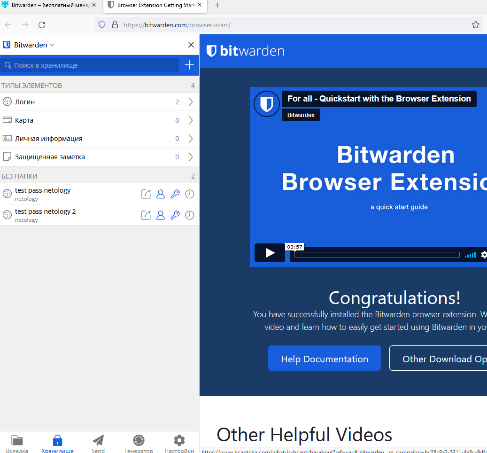
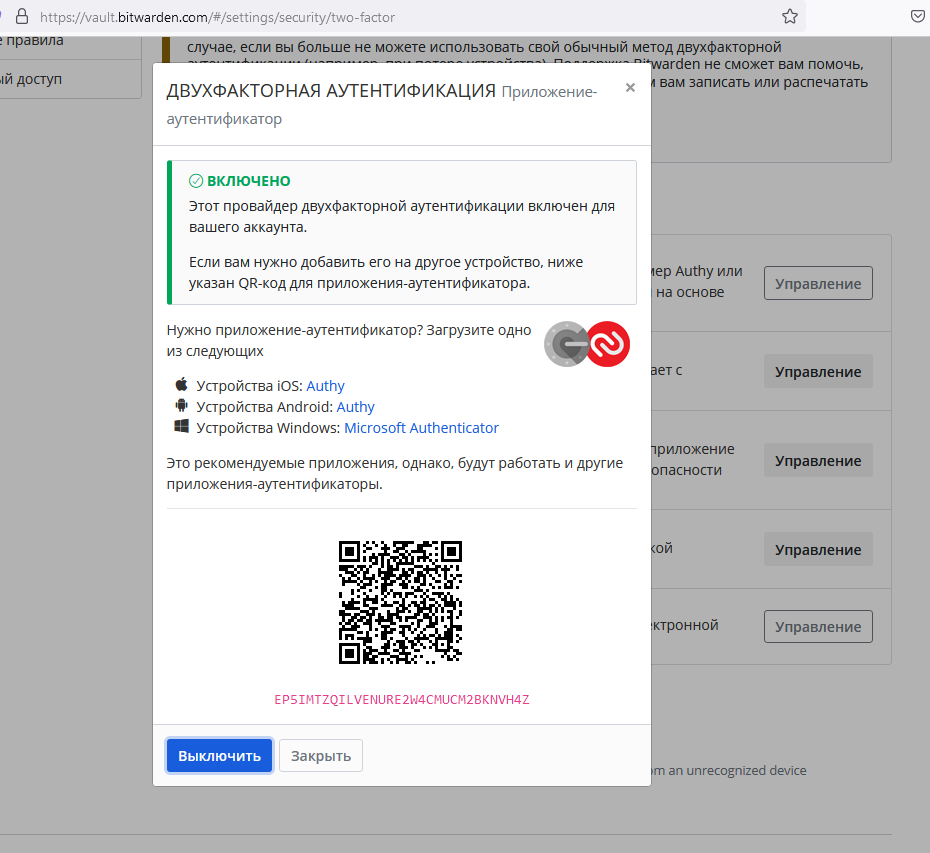
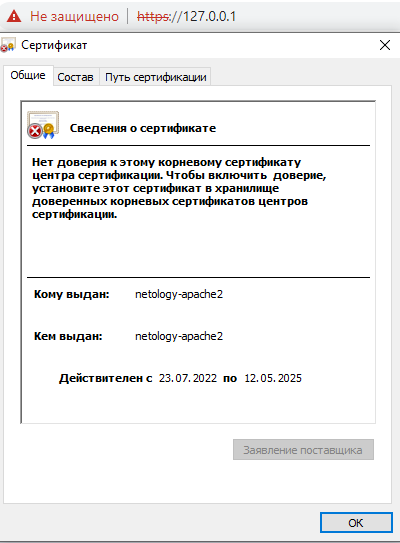

# Решение домашнего задания к занятию "3.9. Элементы безопасности информационных систем"
1. Установите Bitwarden плагин для браузера. Зарегестрируйтесь и сохраните несколько паролей.



2. Установите Google authenticator на мобильный телефон. Настройте вход в Bitwarden акаунт через Google authenticator OTP.



3. Установите apache2, сгенерируйте самоподписанный сертификат, настройте тестовый сайт для работы по HTTPS.

* Поднял Docker-контейнер Ubuntu/Apache2, установил OpenSSL и выполнил команду

```
# openssl req -x509 -nodes -days 1024 -newkey rsa:2048 -sha512 -keyout key.pem -out cert.pem
# a2enmod ssl
```

* Далее в конфигурационном файле  /etc/apache2/sites-available/default-ssl добавил путь к сертификату и ключу

* Теперь сделал docker commit чтобы не потерять конфигурацию своего настроенного контейнера.

```
# docker stop NetologyApache
# docker commit NetologyApache apache
```

* После комита поднял новый контейнер с прокинутыми портами.

```
docker run -p 443:443 --hostname netology-apache2 --name netology-apache2 -itd apache
```



4. Проверьте на TLS уязвимости произвольный сайт в интернете (кроме сайтов МВД, ФСБ, МинОбр, НацБанк, РосКосмос, РосАтом, РосНАНО и любых госкомпаний, объектов КИИ, ВПК ... и тому подобное).

* Использовал команду
```
root@testpc:~# ./testssl.sh/testssl.sh -U --sneaky https://www.ikea.com
```

* Результат сканирования

```
Testing vulnerabilities

 Heartbleed (CVE-2014-0160)                not vulnerable (OK), no heartbeat extension
 CCS (CVE-2014-0224)                       not vulnerable (OK)
 Ticketbleed (CVE-2016-9244), experiment.  not vulnerable (OK)
 ROBOT                                     Server does not support any cipher suites that use RSA key transport
 Secure Renegotiation (RFC 5746)           supported (OK)
 Secure Client-Initiated Renegotiation     VULNERABLE (NOT ok), DoS threat (6 attempts)
 CRIME, TLS (CVE-2012-4929)                not vulnerable (OK)
 BREACH (CVE-2013-3587)                    potentially NOT ok, "gzip" HTTP compression detected. - only supplied "/" tested
                                           Can be ignored for static pages or if no secrets in the page
 POODLE, SSL (CVE-2014-3566)               not vulnerable (OK)
 TLS_FALLBACK_SCSV (RFC 7507)              No fallback possible (OK), no protocol below TLS 1.2 offered
 SWEET32 (CVE-2016-2183, CVE-2016-6329)    not vulnerable (OK)
 FREAK (CVE-2015-0204)                     not vulnerable (OK)
 DROWN (CVE-2016-0800, CVE-2016-0703)      not vulnerable on this host and port (OK)
                                           make sure you don't use this certificate elsewhere with SSLv2 enabled services, see
                                           https://search.censys.io/search?resource=hosts&virtual_hosts=INCLUDE&q=8DF36FE7DEF24310B9ACF49A1CBA2E6F756EFAB39C5072A2A26F6BC5AB5D674B
 LOGJAM (CVE-2015-4000), experimental      not vulnerable (OK): no DH EXPORT ciphers, no DH key detected with <= TLS 1.2
 BEAST (CVE-2011-3389)                     not vulnerable (OK), no SSL3 or TLS1
 LUCKY13 (CVE-2013-0169), experimental     not vulnerable (OK)
 Winshock (CVE-2014-6321), experimental    not vulnerable (OK)
 RC4 (CVE-2013-2566, CVE-2015-2808)        no RC4 ciphers detected (OK)


 Done 2022-07-24 17:50:56 [  93s] -->> 184.85.154.225:443 (www.ikea.com) <<--
```
5-6. Установите на Ubuntu ssh сервер, сгенерируйте новый приватный ключ. Скопируйте свой публичный ключ на другой сервер. Подключитесь к серверу по SSH-ключу.

* Для установки ssh сервера и клиента на Ubuntu используются следующие команды (для выполнения задания поднял 2 контейнера с ubuntu c имена cc73796ced90 и 51facf580f5b):

```
cc73796ced90 # apt install openssh-client
```
* Генерация пары ключей и копирование открытого ключа на ssh-server (На ssh сервере необходимо раскоментировать AuthorizedKeysFile и PubkeyAuthentication, PasswordAuthentication PermitEmptyPasswords поставить значение No ):

```
cc73796ced90 # ssh-keygen -t rsa
```

* После того как сертификаты готовы необходимо скопировать содержимое файла id_rsa.pub в файл ~/.ssh/authorized_keys

* После проведенных манипуляций можно подключиться к нашему серверу:

```
cc73796ced90 # ssh -i ~/.ssh/id_rsa root@172.17.0.4
```

* Для переимения файлов ключей использовал команду mv

* Чтобы можно было подключиться по ssh по имени сервера нужно либо настроитьсвой DNS или внести изменения в в файл /etc/hosts. Либо можно изменить файл конфигурации ~/.ssh/config (В зависимости что имеется ввиду в задании). Например вот так

```
Host ssh-server
    HostName 172.17.0.4
    User root
    Port 22
    IdentityFile ~/.ssh/private_key
```

7. Соберите дамп трафика утилитой tcpdump в формате pcap, 100 пакетов. Откройте файл pcap в Wireshark.

* Для выполнения задания использовал команду

```
# tcpdump -i eth0 -c 100 -w ~/tcpdump.cap
```

8. Просканируйте хост scanme.nmap.org. Какие сервисы запущены?

* Для сканирования использовал команду

```
nmap -T4 -A -v scanme.nmap.org
```
* Открыты порты 22,80,9929,31337. На этих портах работают 
22/tcp OpenSSH 6.6.1p1 Ubuntu 2ubuntu2.13 (Ubuntu Linux; protocol 2.0)
80/tcp    open  http       Apache httpd 2.4.7 ((Ubuntu))
9929/tcp  open  nping-echo Nping echo
31337/tcp open  tcpwrapped

9. Установите и настройте фаервол ufw на web-сервер из задания 3. Откройте доступ снаружи только к портам 22,80,443

```
$ sudo ufw status
[sudo] password for lmin:
Status: active

To                         Action      From
--                         ------      ----
22                         ALLOW       Anywhere
80                         ALLOW       Anywhere
443                        ALLOW       Anywhere
22 (v6)                    ALLOW       Anywhere (v6)
80 (v6)                    ALLOW       Anywhere (v6)
443 (v6)                   ALLOW       Anywhere (v6)
```
